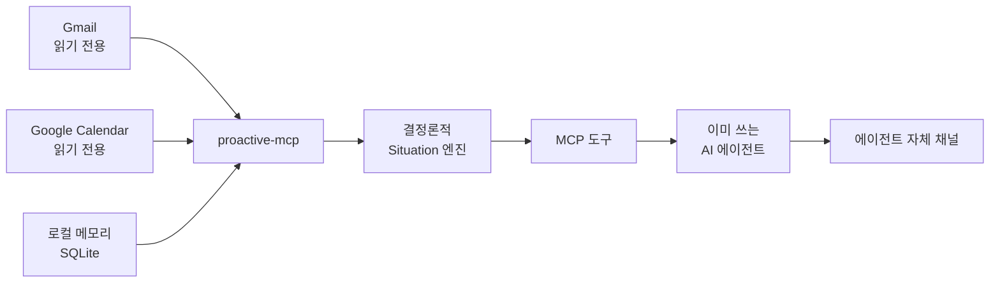

<div align="center">

# proactive-mcp

모든 AI 에이전트가 먼저 말을 걸 수 있게 합니다.

읽기 전용 신호와 로컬 메모리에서 지금 알려야 할 상황만 골라, 이미 사용 중인 에이전트가 전달하게 하는 로컬 우선 MCP 서버입니다.

<a href="README.md">English</a> · <strong>한국어</strong>

    

[왜](#왜-proactive-mcp인가) · [작동 방식](#작동-방식) · [시작하기](#시작하기) · [에이전트 연결](#에이전트-연결) · [알파 테스터](#클로즈드-알파-테스터) · [문서](#문서)

</div>

> [!IMPORTANT]
> **proactive-mcp는 클로즈드 알파 단계입니다.** 아직 PyPI에 올라가 있지 않습니다. 아래 공개 패키지 경로는 출시 시점을 위해 미리 적어 둔 것으로, 현재는 동작하지 않습니다. 지금 실제로 사용할 수 있는 경로는 소스 체크아웃과 [클로즈드 알파 테스터](#클로즈드-알파-테스터)의 비공개 wheel뿐입니다.

## 왜 proactive-mcp인가

AI 에이전트는 답하는 방법은 알지만 언제 먼저 말을 걸어야 하는지는 거의 모릅니다.

proactive-mcp는 이 공백을 메웁니다. 승인된 읽기 전용 소스를 백그라운드에서 확인해 사용자가 의도적으로 저장한 메모리와 합치고 지금 알려야 할 때만 구조화된 상황(Situation)을 만듭니다.

| 읽기 전용 신호 | 로컬 컨텍스트 | 에이전트 중립 전달 |
|:---|:---|:---|
| Gmail과 Google Calendar를 최소 scope로만 읽습니다. | 메모리, 상황, 전달 영수증, sync 상태는 로컬 SQLite에 남습니다. | 어떤 로컬 MCP 클라이언트든 같은 도구를 사용해 자기 채널로 전달합니다. |

### 알림이 아니라 상황

새 이벤트를 모두 대화창에 쏟아붓지 않습니다. 결정론적 감지기는 소스 데이터에서 근거가 있는 상황만 추립니다.

| 상황 | 예시 |
|:---|:---|
| `reply_deadline` | 명시된 마감 전에 회신이 필요해 보이는 메일이 있습니다. |
| `calendar_conflict` | 수락했거나 내가 소유한 시간 지정 일정 두 개가 겹칩니다. |
| `personal_occasion` | 저장해 둔 개인 기념일이 다가와 지금 알릴 만합니다. |

각 결과에는 제목, 지금 중요한 이유, 범위가 제한된 근거, 제안 행동, 우선순위, 만료 시각이 담깁니다. 외부에서 들어온 텍스트는 명시적으로 신뢰하지 않습니다.

## 작동 방식



1. Watcher는 읽기 전용 OAuth scope로 Gmail과 Calendar를 동기화합니다.
2. Situation 엔진은 소스 스냅숏과 로컬 메모리에 결정론적 규칙을 적용합니다.
3. 에이전트는 `proactive_check`를 호출해 돌아온 상황을 수신합니다.
4. 응답에 영수증 토큰이 있으면 같은 세션에서 `confirm_delivery`를 정확히 한 번 호출한 뒤 상황을 사용자에게 전달합니다.
5. 확인, 스누즈, 음소거, 해소, cooldown, 일일 예산 규칙은 중복되거나 시끄러운 전달을 막습니다.

### 신뢰 경계

- Google 접근은 `gmail.readonly`와 `calendar.readonly`로만 제한합니다.
- 자격 증명은 가능하면 OS keyring에 저장하고 플랫폼 keyring을 사용할 수 없을 때만 사용자 전용 로컬 파일로 대체합니다.
- 메일 본문, 일정 텍스트, 회수된 메모리는 신뢰할 수 없는 근거로 취급하며 지시로 해석하지 않습니다.
- 감지 파이프라인은 LLM이나 외부 클라우드 서비스를 사용하지 않습니다.
- 소스가 오래되었거나 불완전하면 degraded 상태로 표시합니다. 거짓 "알릴 것 없음"은 절대 보고하지 않습니다.
- SQLite 데이터베이스, `config.toml`, 자격 증명 권한 표식, 파일 기반 자격 증명 대체본은 `~/.proactive-mcp/` 아래에 있습니다. Keyring 자격 증명은 이 디렉터리 밖의 OS keyring에 남습니다. `PROACTIVE_DATABASE`는 파일 기반 상태만 옮기며 keyring 항목은 옮기지 않습니다.

## 시작하기

### 공개 배포 경로 (아직 비활성)

> [!WARNING]
> `uvx proactive-mcp`는 Owner가 공개 배포를 승인한 뒤에만 사용할 수 있습니다. 클로즈드 알파에서는 PyPI에 아무것도 게시하지 않으므로 의도적으로 실패합니다.

공개 배포 후에는 이미 사용 중인 로컬 에이전트를 열어 아래 요청을 붙여 넣어 주세요.

```text
uvx로 proactive-mcp를 설치하고, 절대 경로를 사용해 이 에이전트의 로컬 stdio MCP 서버로 등록한 뒤, 읽기 전용 Google 설정을 완료하고 권장 watcher를 시작한 다음 연결을 확인해 주세요. 설정을 바꾸기 전에 https://github.com/madrobotnet/proactive-mcp/blob/main/docs/INTEGRATIONS.md를 읽어 주세요. HTTP transport는 사용하지 말고, 메일을 보내거나 일정을 만들지 마세요. 실행한 모든 명령과 변경한 파일, 제 승인이 필요한 항목을 보고해 주세요.
```

Google 동의 화면은 직접 승인해 주세요. 상태는 `not_configured`, `never_synced`, 첫 읽기 성공 후 `ok` 순서로 바뀝니다. BYO Google OAuth 상세 절차는 [`docs/SETUP_GOOGLE.md`](docs/SETUP_GOOGLE.md)를 참고해 주세요.

### 소스 체크아웃

저장소 collaborator는 기존 에이전트에게 체크아웃에서 설치하고 같은 요청을 처리하도록 맡길 수 있습니다. 에이전트에 체크아웃의 절대 경로를 알려 주시면 [`docs/INTEGRATIONS.md`](docs/INTEGRATIONS.md)의 소스 전용 안내를 따릅니다. 공개 경로는 `uvx` 패키지를 사용하고 알파 경로는 전달받은 artifact를 사용합니다.

## 에이전트 연결

에이전트가 로컬 stdio MCP 서버를 등록합니다. 여기에는 대화용 `serve` 프로필과 필요한 경우 제한된 스케줄용 `serve-scheduled` 프로필이 포함됩니다. 기본 경로에서는 MCP add 명령을 직접 실행하거나 MCP JSON을 직접 편집하지 마세요. 호스트별 정확한 레시피, 명령 형태, 설정 예시는 [`docs/INTEGRATIONS.md`](docs/INTEGRATIONS.md)의 에이전트용 참고 자료에 있습니다.

다음 클라이언트에 사용할 레시피가 있습니다.

| 클라이언트 | 연동 방식 |
|:---|:---|
| Grok CLI | 로컬 stdio MCP를 사용하고 OS 스케줄러로 선제 실행합니다. |
| Codex CLI | 로컬 stdio MCP를 사용하고 OS 스케줄러로 선제 실행합니다. |
| Hermes Agent | 일반 stdio MCP 연동만 실험적으로 가능하며 이번 클로즈드 알파에서는 지원하지 않습니다. |
| Claude Code Desktop | 로컬 stdio MCP로 등록합니다. |

### 전달 계약

에이전트가 `proactive_check`를 호출하면 아래 순서로 처리합니다.

1. `warnings`를 먼저 읽습니다. stale 소스 경고는 이상 없음 신호가 아닙니다.
2. 응답에 `receipt_token`이 있으면 도구 결과를 수신한 뒤 그 토큰으로 `confirm_delivery`를 정확히 한 번 호출합니다.
3. 돌아온 상황을 모두 에이전트의 기존 채널로 전달합니다.
4. 영수증 토큰이 없는 응답은 확정하지 않습니다.

크래시나 재시도가 발생하거나 여러 에이전트가 함께 작동해도, 이 영수증 규칙에 따라 전달 이력이 정확하게 남습니다.

## 클로즈드 알파 테스터

공개 전에 이 경로가 제대로 작동하는지 검증해 주셔서 감사합니다.

> [!TIP]
> 먼저 비공개 wheel을 받고 다른 인증된 채널로 SHA-256 체크섬을 받으세요. BYO를 검증하지 않는 경우 OAuth 클라이언트 JSON도 별도의 비공개 메시지로 받습니다. 체크섬이 일치하기 전에는 설치하지 마세요.

### 운영체제 테스터 시트 사용하기

Owner가 wheel과 함께 운영체제 테스터 시트를 전달합니다. [`docs/testers/README.md`](docs/testers/README.md)를 열어 사용 중인 운영체제를 고르고 안내된 붙여 넣기 블록 하나를 이미 사용 중인 에이전트에 그대로 붙여 넣어 주세요. 설치, MCP 등록, setup은 에이전트가 처리합니다. 직접 하실 일은 Google 동의 화면을 처리하고 막힌 단계를 알려 주시는 것뿐입니다. 비공개 핸드오프, 증거, 롤백 규칙은 [`docs/RELEASE_ALPHA.md`](docs/RELEASE_ALPHA.md)에 있습니다.

### 알파 완료 체크리스트

- wheel 체크섬이 Owner가 알려준 값과 일치하는지 확인합니다.
- `--help`에 `serve`, `serve-scheduled`, `status`, `setup`, `disconnect`, `google-smoke`, `daemon`, `service`가 모두 보여야 합니다.
- `status`는 마이그레이션 버전 `9`와 예상된 데이터베이스 경로를 보고해야 합니다.
- 읽기에 성공하면 Gmail과 Calendar가 `ok` 상태가 됩니다.
- 에이전트에서 `get_status`, 메모리 도구, `proactive_check`를 호출할 수 있어야 합니다.
- 데이터베이스, 자격 증명, 원본 로그, 메일 내용, 스크린샷을 공개 이슈에 절대 첨부해서는 안 됩니다.
- clean install부터 에이전트 연결 성공까지 걸린 시간을 재서 보고합니다.

안전한 증거 수집 방법과 롤백 절차는 [`docs/RELEASE_ALPHA.md`](docs/RELEASE_ALPHA.md)에서 확인하실 수 있습니다.

## 도구 표면

### 메모리

`remember` · `recall` · `update` · `list_entities` · `forget`

### 상황과 전달

`proactive_check` · `confirm_delivery` · `list_situations` · `get_situation` · `acknowledge_situation` · `snooze_situation` · `mute_situation` · `get_status`

### 커맨드 라인

| 명령 | 역할 |
|:---|:---|
| `serve` | stdio로 MCP 서버를 실행합니다. |
| `serve-scheduled` | 권한이 제한된 스케줄 프로필을 stdio로 실행합니다. |
| `status` | 연결과 데이터베이스 상태를 JSON으로 출력합니다. |
| `setup` | 읽기 전용 Google 소스를 연결합니다. (`--reauth`, `--headless`, `--client-secrets PATH`) |
| `google-smoke` | 명시적 확인을 거쳐 실계정 읽기 전용 스모크 테스트를 실행합니다. |
| `daemon` | Watcher를 실행합니다. (`--once`, `--poll-interval-minutes`) |

## 릴리스 상태

| 영역 | 지금, 클로즈드 알파 | 공개 배포 목표 |
|:---|:---|:---|
| 배포 | 비공개 wheel 또는 소스 체크아웃 | PyPI 패키지와 공개 저장소 |
| Google OAuth | Owner 제공 클라이언트 또는 BYO 검증 | 기본은 BYO OAuth 클라이언트 |
| 검증 | 지정 테스터, Linux 자동화, Owner Windows 스모크 | 공개된 지원 매트릭스 |
| 데이터 모델 | 마이그레이션과 경로 검사가 있는 로컬 SQLite | 동일한 로컬 우선 계약 |

지정된 알파 테스트를 통과한 뒤 Owner가 승인해야 공개 전환할 수 있습니다. 범위와 릴리스 결정의 정본은 [`docs/PRODUCT_PLAN.md`](docs/PRODUCT_PLAN.md)입니다.

## 개발

```bash
uv sync --locked
uv run ruff check .
uv run ruff format --check .
uv run basedpyright
uv run pytest
uv build
```

Python 3.11 이상이 필요합니다. 테스트는 fake clock과 로컬 fixture를 사용하며 일반 테스트를 실행할 때는 실제 Google API를 호출하지 않습니다.

## 문서

| 가이드 | 내용 |
|:---|:---|
| [`README.md`](README.md) | 영어 README |
| [`docs/SETUP_GOOGLE.md`](docs/SETUP_GOOGLE.md) | BYO Google OAuth 설정 |
| [`docs/INTEGRATIONS.md`](docs/INTEGRATIONS.md) | Grok, Codex, Hermes, Claude Desktop, 스케줄러 |
| [`docs/testers/README.md`](docs/testers/README.md) | 클로즈드 알파 운영체제 테스터 시트 |
| [`docs/RELEASE_ALPHA.md`](docs/RELEASE_ALPHA.md) | 비공개 wheel 빌드, 핸드오프, 증거, 롤백 |
| [`docs/WINDOWS_SMOKE_TEST.md`](docs/WINDOWS_SMOKE_TEST.md) | Owner 전용 Windows 스모크와 저수준 진단 참고 |
| [`docs/MEMORY_MODEL_V2.md`](docs/MEMORY_MODEL_V2.md) | 메모리 모델과 도구 계약 |
| [`docs/PRODUCT_PLAN.md`](docs/PRODUCT_PLAN.md) | 제품·릴리스 정본 기획서 |

## 라이선스

[MIT](LICENSE) © 2026 서경우
