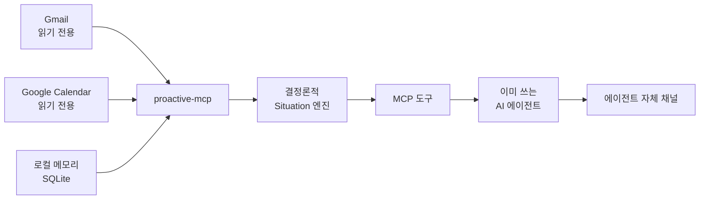

<div align="center">

# proactive-mcp

**모든 AI 에이전트에게 먼저 말 걸 능력을 준다.**

읽기 전용 신호와 로컬 메모리를, 지금 꺼낼 가치가 있는 상황으로 바꿔
이미 쓰고 있는 에이전트가 전달하게 하는 로컬 우선 MCP 서버.

<a href="README.md">English</a> · <strong>한국어</strong>

    

[왜](#왜-proactive-mcp인가) · [작동 방식](#작동-방식) ·
[시작하기](#시작하기) · [에이전트 연결](#에이전트-연결) ·
[알파 테스터](#클로즈드-알파-테스터) · [문서](#문서)

</div>

> [!IMPORTANT]
> **proactive-mcp는 클로즈드 알파 단계다.** 아직 PyPI에 올라가 있지 않으므로
> 아래 공개 배포 명령은 출시 시점을 위해 미리 적어둔 것이고 오늘은 동작하지
> 않는다. 지금 실제로 쓸 수 있는 경로는 소스 체크아웃과
> [클로즈드 알파 테스터](#클로즈드-알파-테스터)의 비공개 wheel이다.

## 왜 proactive-mcp인가

AI 에이전트는 답하는 법은 안다. 언제 먼저 말을 걸어야 하는지는 거의 모른다.

proactive-mcp가 그 빠진 방향을 채운다. 승인된 읽기 전용 소스를 백그라운드에서
지켜보고, 사용자가 의도적으로 저장한 메모리와 합쳐서, 지금 꺼낼 가치가 있을
때만 구조화된 **상황(Situation)** 을 만든다.

| 읽기 전용 신호 | 로컬 컨텍스트 | 에이전트 중립 전달 |
|:---|:---|:---|
| Gmail과 Google Calendar를 최소 scope로만 읽는다. | 메모리, 상황, 전달 영수증, sync 상태는 로컬 SQLite에 남는다. | 어떤 로컬 MCP 클라이언트든 같은 도구를 쓰고 자기 채널로 전달한다. |

### 알림이 아니라 상황

새 이벤트를 전부 대화창에 쏟아붓지 않는다. 결정론적 감지기가 소스 데이터를
근거 있는 소수의 상황으로 바꾼다.

| 상황 | 예시 |
|:---|:---|
| `reply_deadline` | 명시된 마감 전에 회신이 필요해 보이는 메일이 있다. |
| `calendar_conflict` | 일정이 겹치거나 이동 시간이 현실적으로 부족하다. |
| `personal_occasion` | 저장해 둔 개인 기념일이 다가와 지금 알릴 만하다. |

각 결과에는 제목, 지금 중요한 이유, 범위가 제한된 근거, 제안 행동, 우선순위,
만료 시각이 담긴다. 외부에서 들어온 텍스트는 명시적으로 신뢰하지 않는다.

## 작동 방식



1. Watcher가 읽기 전용 OAuth scope로 Gmail과 Calendar를 동기화한다.
2. Situation 엔진이 소스 스냅숏과 로컬 메모리에 결정론적 규칙을 적용한다.
3. 에이전트가 `proactive_check`를 호출하고 돌아온 상황을 사용자에게 전달한다.
4. 전달이 성공한 뒤, 같은 세션이 영수증 토큰으로 `confirm_delivery`를 호출한다.
5. 확인, 스누즈, 음소거, 해소, cooldown, 일일 예산 규칙이 중복되거나 시끄러운
   전달을 막는다.

### 신뢰 경계

- Google 접근은 `gmail.readonly`와 `calendar.readonly`로만 제한된다.
- 자격 증명은 가능하면 OS keyring에 두고, 플랫폼 keyring을 쓸 수 없을 때만
  사용자 전용 로컬 파일로 대체한다.
- 메일 본문, 일정 텍스트, 회수된 메모리는 신뢰할 수 없는 근거로 다루며 지시로
  해석하지 않는다.
- 감지 파이프라인 안에는 LLM도, 외부 클라우드 서비스도 없다.
- 소스가 오래되거나 불완전하면 degraded 상태를 드러낸다. 거짓 "알릴 것 없음"은
  절대 보고하지 않는다.
- 로컬 상태는 모두 `~/.proactive-mcp/` 아래에 있다. SQLite 데이터베이스,
  `config.toml`, 자격 증명 대체 파일까지. `PROACTIVE_DATABASE`로 다른 경로를
  지정하면 상태 디렉터리 전체가 함께 옮겨진다.

## 시작하기

### 공개 배포 경로 (아직 비활성)

> [!WARNING]
> 아래 패키지 인덱스 명령은 Owner가 공개 배포를 승인한 뒤부터 동작한다.
> 클로즈드 알파 동안에는 PyPI에 아무것도 게시되어 있지 않으므로 의도적으로
> 실패한다. 지금은 아래 두 경로 중 하나를 쓴다.

```bash
uv tool install proactive-mcp
proactive-mcp setup
proactive-mcp daemon --once
proactive-mcp status
```

첫 실행에서 기대되는 진행은 이렇다.

1. setup 전: 두 Google 소스 모두 `not_configured`.
2. OAuth setup 후: 두 소스 모두 `never_synced`.
3. 첫 읽기 성공 후: 두 소스 모두 `ok`.

Google Cloud 콘솔 절차와 OAuth 파일을 정확히 어디에 두는지는
[`docs/SETUP_GOOGLE.md`](docs/SETUP_GOOGLE.md)를 따른다.

### 소스에서 설치 (지금 동작)

저장소 collaborator는 지금 이 경로를 쓸 수 있고, 공개 이후에도 계속 쓸모가
있다.

```bash
git clone https://github.com/madrobotnet/proactive-mcp.git
cd proactive-mcp
uv python install 3.11
uv sync --locked
uv run proactive-mcp --help
uv run proactive-mcp setup
uv run proactive-mcp daemon --once
uv run proactive-mcp status
```

소스 체크아웃에서 이후 예시를 따라갈 때는 `proactive-mcp`를
`uv run proactive-mcp`로 읽으면 된다.

## 에이전트 연결

일반적인 MCP 서버 스키마를 쓰는 클라이언트라면 이렇게 등록한다.

```json
{
  "mcpServers": {
    "proactive": {
      "command": "proactive-mcp",
      "args": ["serve"]
    }
  }
}
```

클로즈드 알파 wheel 사용자는 `proactive-mcp` 자리에 가상환경 실행 파일의 절대
경로를 넣는다. 소스 사용자는
[`docs/INTEGRATIONS.md`](docs/INTEGRATIONS.md)에 정리된 절대 `uv` 명령과 저장소
경로를 쓴다.

레시피가 준비된 클라이언트는 다음과 같다.

| 클라이언트 | 연동 방식 |
|:---|:---|
| Grok CLI | 로컬 stdio MCP + OS 스케줄러로 선제 실행 |
| Codex CLI | 로컬 stdio MCP + OS 스케줄러로 선제 실행 |
| Hermes Agent | 로컬 stdio MCP, 선제 전달은 Hermes가 담당 |
| Claude Code Desktop | 로컬 stdio MCP 등록 |

### 전달 계약

에이전트가 `proactive_check`를 호출하면 이렇게 처리한다.

1. `warnings`를 먼저 읽는다. stale 소스 경고는 이상 없음 신호가 아니다.
2. 돌아온 상황을 전부 에이전트의 기존 채널로 전달한다.
3. 전달이 성공한 뒤에만 해당 응답의 `receipt_token`으로 `confirm_delivery`를
   호출한다.
4. 빈 응답이나 실패한 전달을 확정하지 않는다.

이 영수증 규칙이 크래시, 재시도, 여러 에이전트가 섞이는 상황에서도 전달 이력을
정직하게 유지한다.

## 클로즈드 알파 테스터

공개 전에 이 경로를 검증해 주셔서 감사하다.

> [!TIP]
> [`docs/RELEASE_ALPHA.md`](docs/RELEASE_ALPHA.md)의 비공개 핸드오프
> 체크리스트로 시작하고, OAuth는
> [`docs/SETUP_GOOGLE.md`](docs/SETUP_GOOGLE.md)를 따른다.

### 비공개 wheel 설치

Owner가 서로 다른 비공개 채널로 두 가지를 보낸다.

1. wheel 파일과 그 SHA-256 체크섬.
2. OAuth 클라이언트 JSON. BYO 경로를 검증하는 테스터는 받지 않는다.

설치 전에 체크섬을 먼저 확인하고, 그다음에 진행한다.

```bash
uv venv --python 3.11 ~/venvs/proactive
uv pip install \
  --python ~/venvs/proactive/bin/python \
  ./proactive_mcp-0.1.0-py3-none-any.whl

PROACTIVE="$HOME/venvs/proactive/bin/proactive-mcp"
"$PROACTIVE" --help
"$PROACTIVE" setup
"$PROACTIVE" daemon --once
"$PROACTIVE" status
```

Windows 테스터는
[`docs/WINDOWS_SMOKE_TEST.md`](docs/WINDOWS_SMOKE_TEST.md)의 PowerShell 경로를
쓴다.

### 알파 완료 체크리스트

- wheel 체크섬이 Owner가 알려준 값과 일치한다.
- `--help`에 `serve`, `serve-scheduled`, `status`, `setup`, `google-smoke`,
  `daemon`이 모두 보인다.
- `status`가 마이그레이션 버전 `9`와 예상된 데이터베이스 경로를 보고한다.
- 읽기가 성공한 뒤 Gmail과 Calendar가 `ok`가 된다.
- 에이전트가 `get_status`, 메모리 도구, `proactive_check`를 호출할 수 있다.
- 데이터베이스, 자격 증명, 원본 로그, 메일 내용, 스크린샷을 공개 이슈에 절대
  첨부하지 않는다.
- clean install부터 에이전트 연결 성공까지 걸린 시간을 재서 보고한다.

안전한 증거 수집 방법과 롤백 절차는
[`docs/RELEASE_ALPHA.md`](docs/RELEASE_ALPHA.md)에 있다.

## 도구 표면

### 메모리

`remember` · `recall` · `forget` · `link_entities` · `list_entities`

### 상황과 전달

`proactive_check` · `confirm_delivery` · `list_situations` ·
`get_situation` · `acknowledge_situation` · `snooze_situation` ·
`mute_situation` · `resolve_situation` · `get_status`

### 커맨드 라인

| 명령 | 역할 |
|:---|:---|
| `serve` | stdio로 MCP 서버 실행 |
| `serve-scheduled` | 권한이 제한된 스케줄 프로필을 stdio로 실행 |
| `status` | 연결과 데이터베이스 상태를 JSON으로 출력 |
| `setup` | 읽기 전용 Google 소스 연결 (`--reauth`, `--headless`, `--client-secrets PATH`) |
| `google-smoke` | 명시적 확인을 거친 실계정 읽기 전용 스모크 테스트 |
| `daemon` | Watcher 실행 (`--once`, `--poll-interval-minutes`) |

## 릴리스 상태

| 영역 | 지금, 클로즈드 알파 | 공개 배포 목표 |
|:---|:---|:---|
| 배포 | 비공개 wheel 또는 소스 체크아웃 | PyPI 패키지와 공개 저장소 |
| Google OAuth | Owner 제공 클라이언트 또는 BYO 검증 | 기본은 BYO OAuth 클라이언트 |
| 검증 | 지정 테스터, Linux 자동화, Owner Windows 스모크 | 공개된 지원 매트릭스 |
| 데이터 모델 | 마이그레이션과 경로 검사가 있는 로컬 SQLite | 동일한 로컬 우선 계약 |

공개 전환은 지정된 알파 테스트가 통과한 뒤 Owner 승인으로 결정된다. 범위와
릴리스 결정의 정본은 [`docs/PRODUCT_PLAN.md`](docs/PRODUCT_PLAN.md)다.

## 개발

```bash
uv sync --locked
uv run ruff check .
uv run ruff format --check .
uv run basedpyright
uv run pytest
uv build
```

Python 3.11 이상이 필요하다. 테스트는 fake clock과 로컬 fixture를 쓰며, 일반
테스트 실행은 실제 Google API를 호출하지 않는다.

## 문서

| 가이드 | 내용 |
|:---|:---|
| [`README.md`](README.md) | 영어 README |
| [`docs/SETUP_GOOGLE.md`](docs/SETUP_GOOGLE.md) | BYO Google OAuth 설정 |
| [`docs/INTEGRATIONS.md`](docs/INTEGRATIONS.md) | Grok, Codex, Hermes, Claude Desktop, 스케줄러 |
| [`docs/RELEASE_ALPHA.md`](docs/RELEASE_ALPHA.md) | 비공개 wheel 빌드, 핸드오프, 증거, 롤백 |
| [`docs/WINDOWS_SMOKE_TEST.md`](docs/WINDOWS_SMOKE_TEST.md) | Windows Owner·알파 테스터 스모크 경로 |
| [`docs/MEMORY_MODEL_V2.md`](docs/MEMORY_MODEL_V2.md) | 메모리 모델과 도구 계약 |
| [`docs/PRODUCT_PLAN.md`](docs/PRODUCT_PLAN.md) | 제품·릴리스 정본 기획서 |

## 라이선스

[MIT](LICENSE) © 2026 서경우
