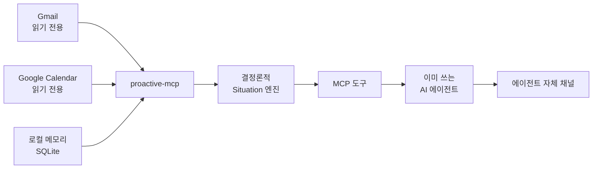

<div align="center">

# proactive-mcp

모든 AI 에이전트가 먼저 말을 걸 수 있게 합니다.

읽기 전용 신호와 로컬 메모리에서 지금 알려야 할 상황만 골라, 이미 사용 중인 에이전트가 전달하게 하는 로컬 우선 MCP 서버입니다.

<a href="README.md">English</a> · <strong>한국어</strong>

     [](https://ko-fi.com/madrobot)

[왜](#왜-proactive-mcp인가) · [작동 방식](#작동-방식) · [시작하기](#시작하기) · [에이전트 연결](#에이전트-연결) · [문서](#문서)

</div>

## 시작하기

로컬 watcher와 OS 알림부터 설정합니다. 에이전트 연결은 선택 사항입니다. [uv](https://docs.astral.sh/uv/getting-started/installation/)와 Git을 설치하고, 본인의 [Google Cloud Desktop OAuth 클라이언트 JSON](docs/SETUP_GOOGLE.md)을 준비하세요.

PyPI에 배포된 `0.2.0`에는 아직 마법사가 없습니다. 온보딩 기능이 배포되기 전까지 아래 명령은 `uvx --from`으로 main에 병합된 `7cd0f03` 커밋의 소스를 설치합니다. 직접 체크아웃할 필요는 없습니다. 모든 명령에서 같은 `--from` 경로를 사용하세요. `uvx proactive-mcp`만 실행하면 이전 PyPI 패키지를 선택합니다. 아래 경로는 소스 설치이며 새 PyPI 릴리스가 아닙니다.

1. 설치와 대화형 설정을 시작합니다.

   ```bash
   uvx --from git+https://github.com/madrobotnet/proactive-mcp@7cd0f03243027df464084c3957f03d3c42169268 proactive-mcp setup
   ```

2. 마법사가 본인의 Google Cloud Desktop OAuth 클라이언트 JSON 경로와 이 장치에서 브라우저를 열지 묻습니다. 본인 클라이언트로만 Gmail과 Calendar의 읽기 전용 동의를 승인하세요. 전체 흐름은 [`docs/SETUP_GOOGLE.md`](docs/SETUP_GOOGLE.md)에 있습니다.
3. Google 인증 뒤 watcher service를 등록하겠다는 제안을 수락하세요. `proactive-mcp service install|status|remove`라는 공통 인터페이스가 Linux의 systemd user service, macOS의 LaunchAgent, Windows의 Task Scheduler를 관리합니다.
4. service 등록을 거절했거나 등록에 성공하면, 대화형 `setup`은 제목이 `proactive-mcp`이고 본문이 `Setup test notification`인 PII 없는 고정 OS test notification을 시도합니다. 이 알림에는 Gmail, Calendar, 계정, Situation 데이터가 없습니다. redacted `unavailable`, `timeout`, `failed`, `unsupported_platform` 경고가 나오면 알림을 표시할 수 없었다는 뜻입니다.
5. service 등록을 거절했거나 권한 문제 등으로 등록에 실패하면 watcher를 직접 실행하세요. 등록 실패 시 `setup`은 test notification을 시도하기 전에 종료됩니다.

**터미널 1, 포그라운드 daemon**
```bash
uvx --from git+https://github.com/madrobotnet/proactive-mcp@7cd0f03243027df464084c3957f03d3c42169268 proactive-mcp daemon
```

**터미널 2, daemon 상태**
```bash
uvx --from git+https://github.com/madrobotnet/proactive-mcp@7cd0f03243027df464084c3957f03d3c42169268 proactive-mcp status
```

`daemon --once`는 한 번만 평가하고 종료하며 `--poll-interval-minutes MINUTES`로 주기를 덮어쓸 수 있습니다. `status`는 연결과 daemon 상태를 redacted JSON으로 보여 줍니다. daemon은 로컬 동기화, 결정론적 평가, 큐 관리, 문서화된 OS fallback만 수행합니다. 호스트나 LLM을 실행하지 않습니다. 호스트 예약은 별개입니다. host/operator가 예약된 에이전트 실행을 시작하고, 그 실행이 `proactive_check`를 호출합니다.

OS fallback은 에이전트 전달을 대신하지 않으며 Situation을 `delivered`로 표시하지도 않습니다. fallback이 활성화된 경우, 수신 이력이 없고 알림 조건을 충족하는 첫 Situation 한 건에만 일회성 bootstrap 예외가 적용됩니다. 그 뒤 기본 fallback은 critical-only입니다. 에이전트가 실제 전달을 시작하려면 `proactive_check`를 호출해야 합니다.

### 호환 모드

`--non-interactive`, `--headless`, `--client-secrets PATH`, `--reauth`는 모두 마법사를 건너뜁니다. 마법사 답변을 미리 채우는 옵션이 아니며 service 제안과 setup test notification도 건너뜁니다. OAuth를 직접 설정해야 할 때만 사용한 뒤 service를 직접 설치하거나 위의 수동 daemon 경로를 사용하세요. service를 관리할 때도 같은 소스 경로를 붙입니다.

```bash
uvx --from git+https://github.com/madrobotnet/proactive-mcp@7cd0f03243027df464084c3957f03d3c42169268 proactive-mcp service install
```

service 상태를 보려면 `install`을 `status`로, 등록을 해제하려면 `remove`로 바꾸세요. `uvx`는 셸에 영구적인 `proactive-mcp` 명령을 추가하지 않습니다. 이 문서의 `proactive-mcp status` 같은 명령 이름에는 위의 `uvx --from` 경로를 붙여 실행하세요.


## 왜 proactive-mcp인가

AI 에이전트는 답하는 방법은 알지만 언제 먼저 말을 걸어야 하는지는 거의 모릅니다.

proactive-mcp는 이 공백을 메웁니다. 승인된 읽기 전용 소스를 백그라운드에서 확인한 다음, 사용자가 의도적으로 저장한 메모리와 합칩니다. 지금 알려야 할 때만 구조화된 상황(Situation)을 만듭니다.

| 읽기 전용 신호 | 로컬 컨텍스트 | 에이전트 중립 전달 |
|:---|:---|:---|
| Gmail과 Google Calendar를 최소 scope로만 읽습니다. | 메모리, 상황, 전달 확정 기록, sync 상태는 로컬 SQLite에 남습니다. | 어떤 로컬 MCP 클라이언트든 같은 도구를 사용해 자기 채널로 전달합니다. |

### 알림이 아니라 상황

새 이벤트를 모두 대화창에 쏟아붓지 않습니다. 결정론적 감지기는 소스 데이터에서 근거가 있는 상황만 추립니다.

| 상황 | 예시 |
|:---|:---|
| `reply_deadline` | 회신 가능성이 있는 메일을 보수적으로 뽑은 후보입니다. 사용자가 행동해야 한다는 판정은 아닙니다. |
| `calendar_conflict` | 수락했거나 내가 소유한 시간 지정 일정 두 개가 겹칩니다. |
| `personal_occasion` | 저장해 둔 개인 기념일이 다가와 지금 알릴 만합니다. |

각 결과에는 제목, 지금 중요한 이유, 범위가 제한된 근거, 제안 행동, 우선순위, 만료 시각이 들어 있습니다. 외부에서 들어온 텍스트는 명시적으로 신뢰하지 않습니다.

## 작동 방식



1. Watcher는 읽기 전용 OAuth scope로 Gmail과 Calendar를 동기화합니다.
2. Situation 엔진은 소스 스냅숏과 로컬 메모리에 결정론적 규칙을 적용합니다.
3. 에이전트는 `proactive_check`를 호출해 돌아온 상황을 수신합니다.
4. 호스트는 lease 전체를 검토해 이 사용자에게 필요한 후보만 고릅니다. 불확실한 후보는 미확정 상태로 두거나 snooze할 수 있습니다. 검토 뒤 확정하기로 선택할 때만, 보여 주지 않기로 확신한 후보까지 포함한 전체 lease를 정확히 한 번 확정합니다.
5. 확인, 스누즈, 음소거, 해소, cooldown, 일일 예산 규칙은 중복되거나 시끄러운 전달을 막습니다.

기본적으로 local quiet hours인 21:00~07:00에는 critical이 아닌 상황을 보류하며, 버리지 않고 pending 상태로 유지해 다음 조회로 이월합니다. 07:00에 자동으로 실행되는 동작은 없습니다. Quiet hours가 끝난 뒤 실행 중이거나 host가 예약한 agent가 `proactive_check`를 호출해야 합니다.

### 신뢰 경계

- Google 접근은 `gmail.readonly`와 `calendar.readonly`로만 제한합니다.
- 자격 증명은 가능하면 OS keyring에 저장하고 플랫폼 keyring을 사용할 수 없을 때만 사용자 전용 로컬 파일로 대체합니다.
- 메일 본문, 일정 텍스트, 회수된 메모리는 신뢰할 수 없는 근거로 취급합니다. 지시로 해석하지 않습니다.
- 감지 파이프라인은 LLM이나 외부 클라우드 서비스를 사용하지 않습니다. proactive-mcp는 호스트 에이전트·모델을 시작하거나 prompt를 보내지 않습니다.
- 소스가 오래되었거나 불완전하면 degraded 상태로 표시합니다. 거짓 "알릴 것 없음"은 절대 보고하지 않습니다.
- SQLite 데이터베이스, `config.toml`, 자격 증명 권한 표식, 파일 기반 자격 증명 대체본은 `~/.proactive-mcp/` 아래에 있습니다. Keyring 자격 증명은 이 디렉터리 밖의 OS keyring에 남습니다. `PROACTIVE_DATABASE`는 파일 기반 상태만 옮기며 keyring 항목은 옮기지 않습니다.

## 에이전트 연결

호스트 연결은 선택 사항입니다. OS 알림의 선행 조건은 아니지만, 에이전트를 연결하면 더 풍부한 전달과 acknowledge, snooze, mute를 사용할 수 있습니다. 아래 지시문은 기존 로컬 에이전트에 MCP를 등록할 때 쓸 수 있습니다.

위의 소스 설치 경로를 사용했다면, 에이전트에게 PyPI로 바꾸지 말고 MCP 등록에도 같은 `uvx --from` 소스와 커밋을 유지하도록 요청하세요. 아래 재사용 지시문과 호스트 레시피는 공개 설치 명령 형태를 그대로 담고 있습니다.

<details>
<summary>선택 사항: 에이전트에 붙여 넣을 지시문</summary>

```text
PyPI에서 uvx로 proactive-mcp를 설치하세요. 절대 경로를 사용해 이 에이전트의 로컬 stdio MCP 서버로 등록하세요. 읽기 전용 Google 연결은 제 Google Cloud Desktop OAuth 클라이언트 JSON(BYO)으로 하세요. 다른 사람 클라이언트 secret을 쓰거나 요청하지 마세요. 권장 watcher를 시작하고 연결을 확인하세요. 설정을 바꾸기 전에 https://github.com/madrobotnet/proactive-mcp/blob/main/docs/INTEGRATIONS.md와 https://github.com/madrobotnet/proactive-mcp/blob/main/docs/SETUP_GOOGLE.md를 읽어 주세요. reply_deadline은 행동 필요 판정이 아니라 보수적으로 뽑은 후보로 취급하세요. 사용자에게 말하기 전에 뉴스레터, 마케팅, 자동 영수증, 요청이 없는 FYI 또는 FYI-CC, 다른 사람이 맡은 스레드, 저에게 답해야 할 질문·요청·결정이 없는 행은 확신할 수 있을 때 제외하세요. 명시적인 회신·RSVP·결정 요청, 제가 책임진 마감, 저에게 직접 묻고 아직 답하지 않은 질문은 유지하세요. 불확실한 후보는 저에게 알리거나 lease 전체를 미확정 상태로 두거나 일상 대화에서 snooze하세요. 비실행 항목이라고 조용히 버리지 마세요. 모든 행을 검토한 뒤 확정하기로 선택할 때만, 보여 주지 않기로 확신한 후보까지 포함해 검토한 lease 전체를 정확히 한 번 confirm_delivery 하세요. MCP 도구명·설명·필드·값은 영어로 유지하되 저에게는 제 언어로 말하세요. 일상 대화에는 serve만 로드하고 별도 예약 대화에는 serve-scheduled만 로드하세요. 한 대화에 두 프로필을 함께 로드하지 마세요. 이 host가 dedicated per-run MCP profile을 보장하지 못하면 자동 예약을 구성하지 말고, proactive-mcp가 host를 시작하거나 검증하게 만들지 마세요. HTTP transport는 사용하지 말고, 메일을 보내거나 일정을 만들지 마세요. 실행한 모든 명령과 변경한 파일, 제 승인이 필요한 항목을 보고해 주세요.
```

</details>

proactive-mcp는 에이전트 의존 MCP입니다. 로컬 stdio 도구를 제공하지만 Grok, Codex, Hermes, 다른 호스트 에이전트나 모델을 시작하지 않습니다. `serve-scheduled`는 제한된 MCP surface일 뿐 scheduler가 아닙니다. 이것이나 daemon만 실행해도 대화나 전달은 생기지 않습니다. pending 상황은 실행 중이거나 호스트가 예약한 에이전트가 도구를 명시적으로 호출할 때까지 남습니다.

일상 대화에는 `serve`만, 별도 수동/예약 대화에는 `serve-scheduled`만 로드합니다. 격리와 agent lifecycle은 plugin 밖의 host/operator 책임입니다. Host가 `serve-scheduled`만 담긴 dedicated per-run MCP profile을 제공할 때만 자동 예약을 지원하며 그렇지 않으면 예약하지 않는 방식으로 fail closed합니다. 수동 restricted 대화는 가능합니다.

| 클라이언트 | 연동 방식 |
|:---|:---|
| Grok CLI 0.2.112 | 병합 source에서 immutable per-run 격리를 증명할 수 없어 unattended scheduling을 광고하지 않음. 수동 dedicated restricted profile만 가능 |
| Codex CLI | config layer 격리를 plugin이 보장하지 않음. Host/operator가 별도 per-run profile을 보장할 때만 예약 |
| Hermes Agent | 로컬 stdio. 호스트가 전용 per-run 프로필을 보장할 때만 예약 |
| Claude Code Desktop | 해당 version이 dedicated per-task MCP profile을 제공할 때만 local task 가능 |

Daemon은 local sync·결정론 평가·queue·문서화된 critical OS fallback만 수행합니다. agent/LLM을 호출하거나 prompt를 보내지 않습니다. 상세 계약은 [`docs/INTEGRATIONS.md`](docs/INTEGRATIONS.md)에 있습니다.

### 전달 계약

에이전트가 `proactive_check`를 호출하면 아래 순서로 처리합니다.

1. `warnings`를 먼저 읽습니다. stale 소스 경고는 이상 없음 신호가 아닙니다. `reply_deadline`은 행동 필요 판정이 아니라 보수적인 후보입니다.
2. 사용자에게 말하기 전에 뉴스레터, 마케팅, 자동 영수증, 요청이 없는 FYI 또는 FYI-CC, 다른 사람이 맡은 스레드, 이 사용자에게 답해야 할 질문·요청·결정이 없는 행은 확신할 수 있을 때 제외합니다.
3. 명시적인 회신·RSVP·결정 요청, 사용자가 책임진 마감, 이 사용자에게 직접 묻고 아직 답하지 않은 질문은 유지합니다.
4. 불확실한 후보는 사용자에게 알리거나 lease 전체를 미확정 상태로 두거나 일상용 프로필에서 snooze합니다. 비실행 항목이라고 조용히 버리지 않습니다.
5. 모든 행을 검토한 뒤 확정하기로 선택할 때만, 이번 조회를 닫는 `receipt_token`으로 검토한 lease 전체를 정확히 한 번 `confirm_delivery` 합니다. 이 확정에는 호스트가 사용자에게 보여 주지 않기로 확신한 후보도 포함됩니다. 토큰이 없는 응답은 확정하지 않습니다.
6. MCP 도구명·설명·필드·값은 영어로 유지합니다. 사용자에게는 사용자의 언어로 말합니다.
7. 일상 대화와 예약 실행은 별도 대화로 운영합니다. 전자에는 `serve`만, 후자에는 `serve-scheduled`만 로드하며 한 대화에 두 프로필을 함께 로드하지 않습니다. Host/operator가 이 격리를 소유하며 dedicated per-run profile이 없으면 자동 예약하지 않습니다.

크래시나 재시도가 발생하거나 여러 에이전트가 함께 작동해도 이 전달 확정 규칙에 따라 전달 이력이 정확하게 남습니다.

## 도구 표면

### 메모리

`remember` · `recall` · `update` · `list_entities` · `forget`

### 상황과 전달

`proactive_check` · `confirm_delivery` · `list_situations` · `get_situation` · `acknowledge_situation` · `snooze_situation` · `mute_situation` · `get_status`

## 릴리스 상태

| 영역 | 지금 |
|:---|:---|
| 배포 | PyPI 패키지 `proactive-mcp` 0.2.0, `uvx`로 설치 |
| Google OAuth | 본인 Desktop OAuth 클라이언트 (BYO) |
| 호스트 | 일상 사용은 Grok CLI와 Codex CLI |
| 데이터 | `~/.proactive-mcp/` 아래 로컬 SQLite |

범위와 릴리스 결정의 정본은 [`docs/PRODUCT_PLAN.md`](docs/PRODUCT_PLAN.md)입니다.

## 문서

| 가이드 | 내용 |
|:---|:---|
| [`README.md`](README.md) | 영어 README |
| [`docs/SETUP_GOOGLE.md`](docs/SETUP_GOOGLE.md) | BYO Google OAuth (공개 후 기본) |
| [`docs/INTEGRATIONS.md`](docs/INTEGRATIONS.md) | 온보딩과 service 명령, 선택 사항인 호스트 레시피 |
| [`docs/STATE_MODEL.md`](docs/STATE_MODEL.md) | 소스, lease, collector, daemon, fallback, receipt 상태 의미 |
| [`docs/MEMORY_MODEL_V2.md`](docs/MEMORY_MODEL_V2.md) | 메모리 모델과 도구 계약 |

## 라이선스

[MIT](LICENSE) © 2026 서경우 <[hello@madrobot.net](mailto:hello@madrobot.net)>

이 프로젝트는 [OmO Native](https://github.com/code-yeongyu/oh-my-openagent)로 제작했습니다.

도움이 되셨다면 [Ko-fi](https://ko-fi.com/madrobot)에서 후원하실 수 있습니다.

[](https://ko-fi.com/madrobot)
