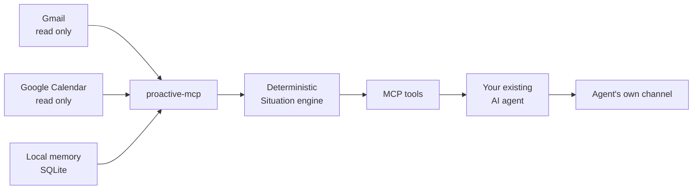

<div align="center">

# proactive-mcp

Give every AI agent a reason to reach out first.

A local-first MCP server that turns read-only signals and local memory into grounded situations your existing agent can deliver at the right time.

<strong>English</strong> · <a href="README.ko.md">한국어</a>

    

[Why](#why-proactive-mcp) · [How it works](#how-it-works) · [Get started](#get-started) · [Connect an agent](#connect-an-agent) · [Alpha testers](#closed-alpha-testers) · [Documentation](#documentation)

</div>

> [!IMPORTANT]
> **proactive-mcp is in closed alpha.** The package isn't on PyPI yet, so the public package path below is written for launch day and doesn't work today. What works right now is a source checkout or the private tester artifact in [Closed-alpha testers](#closed-alpha-testers).

## Why proactive-mcp?

AI agents know how to answer. They rarely know when to start.

proactive-mcp supplies that direction. It watches approved read-only sources in the background, combines them with memory the user intentionally saved, and produces a structured Situation only when something is worth raising now.

| Read-only signals | Local context | Agent-neutral delivery |
|:---|:---|:---|
| Gmail and Google Calendar are read through minimal scopes. | Memories, situations, receipts, and sync state stay in local SQLite. | Any local MCP client can use the same tools and deliver through its own channel. |

### Situations, not notifications

proactive-mcp doesn't push every new event into your chat. Deterministic detectors turn source data into a small set of situations grounded in the source data:

| Situation | Example |
|:---|:---|
| `reply_deadline` | A message appears to need a reply before a stated deadline. |
| `calendar_conflict` | Two accepted or owned timed events overlap. |
| `personal_occasion` | A saved personal date is approaching and relevant now. |

Each result carries a title, why it matters now, bounded evidence, suggested actions, priority, and expiry. External text remains explicitly untrusted.

## How it works



1. A watcher synchronizes Gmail and Calendar with read-only OAuth scopes.
2. The situation engine evaluates deterministic rules against source snapshots and local memory.
3. The agent calls `proactive_check` and receives any returned situations.
4. If the response has a receipt token, the same session calls `confirm_delivery` exactly once, then presents the situations.
5. Acknowledgement, snooze, mute, resolution, cooldown, and daily budget rules prevent repeated or noisy delivery.

### Trust boundaries

- Google access is limited to `gmail.readonly` and `calendar.readonly`.
- Credentials use the operating-system keyring when available, with a private local fallback only when the platform keyring is unavailable.
- Message bodies, calendar text, and recalled memory are treated as untrusted evidence, never as instructions.
- No LLM or third-party cloud service sits inside the detection pipeline.
- Stale or incomplete sources produce visible degraded status, never a false "nothing to report."
- The SQLite database, `config.toml`, credential authority marker, and any file-backed credential fallback live under `~/.proactive-mcp/`. A keyring credential stays in the operating-system keyring, outside that directory. `PROACTIVE_DATABASE` moves the file-backed state, not the keyring entry.

## Get started

### Public release path (not active yet)

> [!WARNING]
> `uvx proactive-mcp` becomes available only after the Owner approves the public release. During the closed alpha it fails by design because nothing is published to PyPI.

After public release, open the local agent you already use and paste this request:

```text
Install proactive-mcp with uvx, register it as a local stdio MCP server for this agent with absolute paths, complete its read-only Google setup, start the recommended watcher, and verify the connection. Read https://github.com/madrobotnet/proactive-mcp/blob/main/docs/INTEGRATIONS.md before changing configuration. Do not use HTTP transport, do not send mail or create calendar events, and report every command and file changed plus anything that needs my approval.
```

You approve the Google consent screen. The expected status progression is `not_configured`, then `never_synced`, then `ok` after the first successful read. For BYO Google OAuth details, see [`docs/SETUP_GOOGLE.md`](docs/SETUP_GOOGLE.md).

### Source checkout

Repository collaborators can ask their existing agent to install from its checkout and complete the same request. Give the agent the checkout's absolute path; it can follow the source-specific instructions in [`docs/INTEGRATIONS.md`](docs/INTEGRATIONS.md). The public path uses the package through `uvx`; the alpha path uses the delivered artifact.

## Connect an agent

Your agent registers the local stdio MCP server, including the interactive `serve` profile and, where needed, the restricted `serve-scheduled` profile. Don't manually run an MCP add command or edit MCP JSON for the primary path. The exact host recipes, command shapes, and configuration examples are agent-facing references in [`docs/INTEGRATIONS.md`](docs/INTEGRATIONS.md).

Integration recipes are available for:

| Client | Integration model |
|:---|:---|
| Grok CLI | Local stdio MCP plus an OS scheduler for proactive runs |
| Codex CLI | Local stdio MCP plus an OS scheduler for proactive runs |
| Hermes Agent | Local stdio MCP with Hermes-managed proactive delivery |
| Claude Code Desktop | Local stdio MCP registration |

### The delivery contract

When an agent calls `proactive_check`:

1. Read `warnings` first. Stale-source warnings are not an all-clear.
2. If the response has a `receipt_token`, call `confirm_delivery` with it exactly once after receiving the tool result.
3. Present every returned situation through the agent's existing channel.
4. Never confirm a response without a receipt token.

This receipt rule keeps delivery history accurate across crashes, retries, and multiple agents.

## Closed-alpha testers

Thank you for validating this path before public release.

> [!TIP]
> Receive the private wheel first, its SHA-256 checksum through a different authenticated channel, and, unless you are validating BYO, the OAuth client JSON in a separate private message. Do not install anything until the checksum matches.

### Use your OS tester sheet

The Owner sends the OS tester sheet alongside the wheel. Open [`docs/testers/README.md`](docs/testers/README.md), choose your operating system, and paste exactly its one block into the agent you already use. The agent performs installation, MCP registration, and setup. You only handle the Google consent screen and report blocked steps. Private handoff, evidence, and rollback rules are in [`docs/RELEASE_ALPHA.md`](docs/RELEASE_ALPHA.md).

### Alpha completion checklist

- The wheel checksum matches the Owner's value.
- `--help` shows `serve`, `serve-scheduled`, `status`, `setup`, `google-smoke`, and `daemon`.
- `status` reports migration version `9` and the expected database path.
- Gmail and Calendar become `ok` after a successful read.
- The agent can call `get_status`, memory tools, and `proactive_check`.
- No database, credentials, raw logs, message content, or screenshots are attached to a public issue.
- Clean install through first working agent connection is timed and reported.

Find safe evidence and rollback instructions in [`docs/RELEASE_ALPHA.md`](docs/RELEASE_ALPHA.md).

## Tool surface

### Memory

`remember` · `recall` · `update` · `list_entities` · `forget`

### Situations and delivery

`proactive_check` · `confirm_delivery` · `list_situations` · `get_situation` · `acknowledge_situation` · `snooze_situation` · `mute_situation` · `get_status`

### Command line

| Command | What it does |
|:---|:---|
| `serve` | Run the MCP server over stdio |
| `serve-scheduled` | Run the restricted scheduled profile over stdio |
| `status` | Print connection and database status as JSON |
| `setup` | Connect read-only Google sources (`--reauth`, `--headless`, `--client-secrets PATH`) |
| `google-smoke` | Confirmed read-only smoke test against a real account |
| `daemon` | Run the watcher (`--once`, `--poll-interval-minutes`) |

## Release status

| Area | Closed alpha now | Public release target |
|:---|:---|:---|
| Distribution | Private tester artifact or source checkout | PyPI package and public repository |
| Google OAuth | Owner-provided client or BYO validation | BYO OAuth client by default |
| Validation | Named testers, Linux automation, Owner Windows smoke | Published support matrix |
| Data model | Local SQLite with migrations and private-path checks | Same local-first contract |

The public transition requires Owner approval after the designated alpha tests pass. Scope and release decisions remain canonical in [`docs/PRODUCT_PLAN.md`](docs/PRODUCT_PLAN.md).

## Development

```bash
uv sync --locked
uv run ruff check .
uv run ruff format --check .
uv run basedpyright
uv run pytest
uv build
```

Python 3.11 or newer is required. Tests use fake clocks and local fixtures; normal test runs do not call real Google APIs.

## Documentation

| Guide | Purpose |
|:---|:---|
| [`README.ko.md`](README.ko.md) | Korean README |
| [`docs/SETUP_GOOGLE.md`](docs/SETUP_GOOGLE.md) | BYO Google OAuth setup |
| [`docs/INTEGRATIONS.md`](docs/INTEGRATIONS.md) | Grok, Codex, Hermes, Claude Desktop, and schedulers |
| [`docs/testers/README.md`](docs/testers/README.md) | Closed-alpha OS tester sheets |
| [`docs/RELEASE_ALPHA.md`](docs/RELEASE_ALPHA.md) | Private wheel build, handoff, evidence, and rollback |
| [`docs/WINDOWS_SMOKE_TEST.md`](docs/WINDOWS_SMOKE_TEST.md) | Owner-only Windows smoke and low-level diagnostic reference |
| [`docs/MEMORY_MODEL_V2.md`](docs/MEMORY_MODEL_V2.md) | Memory model and tool contracts |
| [`docs/PRODUCT_PLAN.md`](docs/PRODUCT_PLAN.md) | Canonical product and release plan |

## License

[MIT](LICENSE) © 2026 Kyungwoo Seo
