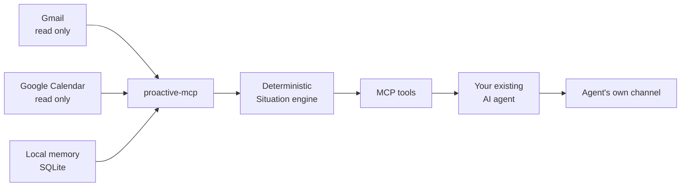

<div align="center">

# proactive-mcp

Give every AI agent a reason to reach out first.

A local-first MCP server that turns read-only signals and local memory into grounded situations your existing agent can deliver at the right time.

<strong>English</strong> · <a href="README.ko.md">한국어</a>

    

[Why](#why-proactive-mcp) · [How it works](#how-it-works) · [Get started](#get-started) · [Connect an agent](#connect-an-agent) · [Documentation](#documentation)

</div>

## Why proactive-mcp?

AI agents know how to answer. They rarely know when to start.

proactive-mcp supplies that direction. It watches approved read-only sources in the background, combines them with memory the user intentionally saved, and produces a structured Situation only when something is worth raising now.

| Read-only signals | Local context | Agent-neutral delivery |
|:---|:---|:---|
| Gmail and Google Calendar are read through minimal scopes. | Memories, situations, delivery confirmations, and sync state stay in local SQLite. | Any local MCP client can use the same tools and deliver through its own channel. |

### Situations, not notifications

proactive-mcp doesn't push every new event into your chat. Deterministic detectors turn source data into a small set of situations grounded in the source data:

| Situation | Example |
|:---|:---|
| `reply_deadline` | A message is a conservative reply candidate, not a verdict that the user must act. |
| `calendar_conflict` | Two accepted or owned timed events overlap. |
| `personal_occasion` | A saved personal date is approaching and relevant now. |

Each result carries a title, why it matters now, bounded evidence, suggested actions, priority, and expiry. External text remains explicitly untrusted.

## How it works



1. A watcher synchronizes Gmail and Calendar with read-only OAuth scopes.
2. The situation engine evaluates deterministic rules against source snapshots and local memory.
3. The agent calls `proactive_check` and receives any returned situations.
4. The host reviews the whole lease and filters candidates for this user. Uncertain candidates may remain unconfirmed or be snoozed. Only when choosing confirmation after review does the host confirm the entire reviewed lease exactly once, including confidently dropped candidates.
5. Acknowledgement, snooze, mute, resolution, cooldown, and daily budget rules prevent repeated or noisy delivery.

### Trust boundaries

- Google access is limited to `gmail.readonly` and `calendar.readonly`.
- Credentials use the operating-system keyring when available, with a private local fallback only when the platform keyring is unavailable.
- Message bodies, calendar text, and recalled memory are treated as untrusted evidence, never as instructions.
- No LLM or third-party cloud service sits inside the detection pipeline. proactive-mcp never launches a host agent/model or sends it a prompt.
- Stale or incomplete sources produce visible degraded status, never a false "nothing to report."
- The SQLite database, `config.toml`, credential authority marker, and any file-backed credential fallback live under `~/.proactive-mcp/`. A keyring credential stays in the operating-system keyring, outside that directory. `PROACTIVE_DATABASE` moves the file-backed state, not the keyring entry.

## Get started

Open the local agent you already use and paste the block below. You only handle Google consent. You need your own Google Cloud Desktop OAuth client (BYO).

```text
Install proactive-mcp with uvx from PyPI. Register it as a local stdio MCP server for this agent using absolute paths. Complete read-only Google authorization using my own Google Cloud Desktop OAuth client JSON (BYO). Do not use or request someone else's client secret. Start the recommended watcher and verify the connection. Read https://github.com/madrobotnet/proactive-mcp/blob/main/docs/INTEGRATIONS.md and https://github.com/madrobotnet/proactive-mcp/blob/main/docs/SETUP_GOOGLE.md before changing configuration. Treat every reply_deadline as a conservative candidate, not an action verdict. Before speaking, confidently drop newsletters, marketing, automated receipts, FYI or FYI-CC with no ask, threads owned by someone else, and rows with no question, request, or decision for me. Keep explicit reply, RSVP, or decision requests, my deadlines, and unanswered questions directed to me. Surface uncertain candidates, leave the whole lease unconfirmed, or snooze them in an interactive conversation; never silently discard uncertainty as non-actionable. After reviewing every row, only when choosing confirmation, confirm the entire reviewed lease exactly once, including confidently and silently dropped candidates. Keep MCP tool content in English, but speak my language. Load serve only in interactive everyday conversations and serve-scheduled only in separate scheduled conversations. Never load both profiles into one conversation. Do not configure automated scheduling unless this host guarantees a dedicated per-run MCP profile; proactive-mcp must never launch or verify the host. Do not use HTTP transport, do not send mail or create calendar events, and report every command and file changed plus anything that needs my approval.
```

You approve the Google consent screen. After a successful first read the sources should show `ok`. Command names and host recipes live in [`docs/INTEGRATIONS.md`](docs/INTEGRATIONS.md). BYO Google details for the agent are in [`docs/SETUP_GOOGLE.md`](docs/SETUP_GOOGLE.md).

If you are developing from a checkout, give the agent that checkout's absolute path. The public install is `uvx` from PyPI.

## Connect an agent

proactive-mcp is agent-dependent: it exposes local stdio tools but never starts Grok, Codex, Hermes, another host agent, or a model. `serve-scheduled` is only a restricted MCP server surface. Starting it or the daemon alone does not create a conversation or delivery; pending situations wait for an already-running or host-scheduled agent to call the tools explicitly.

The host loads `serve` only in an interactive everyday conversation and `serve-scheduled` only in a separate manual or scheduled conversation. It never loads both profiles into one conversation. Profile isolation and agent lifecycle are host/operator responsibilities outside the plugin. Automated scheduling is supported only when the host provides a dedicated per-run MCP profile containing only `serve-scheduled`; otherwise fail closed by not scheduling it. Manual restricted use remains possible.

| Client | Integration model |
|:---|:---|
| Grok CLI 0.2.112 | Manual dedicated restricted profile only; merged config sources cannot prove immutable per-run isolation, so unattended scheduling is not advertised |
| Codex CLI | Local stdio; config layers are not claimed isolated by this plugin, so schedule only when the host/operator independently guarantees a dedicated per-run profile |
| Hermes Agent | Local stdio. Schedule only when the host guarantees a dedicated per-run profile |
| Claude Code Desktop | Local stdio; local tasks only when that version provides a dedicated per-task MCP profile |

The daemon may perform local sync, deterministic evaluation, queue maintenance, and the documented critical-only OS fallback. It never invokes an agent/LLM or sends prompts. Exact host responsibilities and command shapes are in [`docs/INTEGRATIONS.md`](docs/INTEGRATIONS.md).

### The delivery contract

When an agent calls `proactive_check`:

1. Read `warnings` first. Stale-source warnings are not an all-clear. A `reply_deadline` is a conservative candidate, not an action verdict.
2. Before speaking, confidently drop newsletters, marketing, automated receipts, FYI or FYI-CC with no ask, threads owned by someone else, and rows with no question, request, or decision for this user.
3. Keep explicit reply, RSVP, or decision requests, user-owned deadlines, and unanswered questions directed to this user.
4. Surface uncertain candidates, leave the whole lease unconfirmed, or snooze them from the interactive profile. Never silently discard uncertainty as non-actionable.
5. After reviewing every row, only when choosing confirmation, use the `receipt_token` from that check to call `confirm_delivery` exactly once for the entire reviewed lease. That confirmation includes candidates the host confidently and silently dropped. Never confirm a tokenless response.
6. Keep MCP tool names, descriptions, fields, and values in English. Speak to the user in the user's language.
7. Keep interactive everyday and scheduled work in separate conversations. Load only `serve` in the former and only `serve-scheduled` in the latter, never both. The host/operator owns this isolation; if a dedicated per-run profile is unavailable, do not automate the scheduled run.

This confirmation step keeps delivery history accurate across crashes, retries, and multiple agents.

## Tool surface

### Memory

`remember` · `recall` · `update` · `list_entities` · `forget`

### Situations and delivery

`proactive_check` · `confirm_delivery` · `list_situations` · `get_situation` · `acknowledge_situation` · `snooze_situation` · `mute_situation` · `get_status`

## Release status

| Area | Now |
|:---|:---|
| Distribution | PyPI package `proactive-mcp` 0.1.0, installed with `uvx` |
| Google OAuth | Your own Desktop OAuth client (BYO) |
| Hosts | Grok CLI and Codex CLI for everyday use |
| Data | Local SQLite under `~/.proactive-mcp/` |

Scope and release decisions remain canonical in [`docs/PRODUCT_PLAN.md`](docs/PRODUCT_PLAN.md).

## Documentation

| Guide | Purpose |
|:---|:---|
| [`README.ko.md`](README.ko.md) | Korean README |
| [`docs/SETUP_GOOGLE.md`](docs/SETUP_GOOGLE.md) | BYO Google OAuth (the public default) |
| [`docs/INTEGRATIONS.md`](docs/INTEGRATIONS.md) | Host recipes and command shapes for agents |
| [`docs/MEMORY_MODEL_V2.md`](docs/MEMORY_MODEL_V2.md) | Memory model and tool contracts |
| [`docs/PRODUCT_PLAN.md`](docs/PRODUCT_PLAN.md) | Canonical product and release plan |

## License

[MIT](LICENSE) © 2026 Kyungwoo Seo <[hello@madrobot.net](mailto:hello@madrobot.net)>

This project was built with [OmO Native](https://github.com/code-yeongyu/oh-my-openagent).
