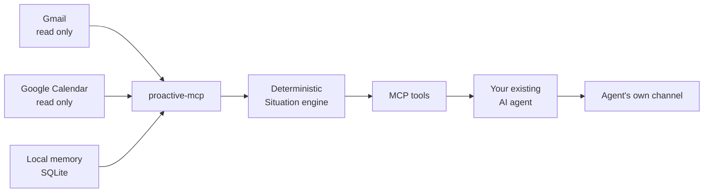

<div align="center">

# proactive-mcp

**Give every AI agent the ability to reach out first.**

A local-first MCP server that turns read-only signals and local memory into
timely, grounded situations your existing agent can deliver.

<strong>English</strong> · <a href="README.ko.md">한국어</a>

    

[Why](#why-proactive-mcp) · [How it works](#how-it-works) ·
[Get started](#get-started) · [Connect an agent](#connect-an-agent) ·
[Alpha testers](#closed-alpha-testers) · [Documentation](#documentation)

</div>

> [!IMPORTANT]
> **proactive-mcp is in closed alpha.** The package isn't on PyPI yet, so the
> public-release commands below are written for launch day and don't work
> today. What works right now is a source checkout or the private wheel in
> [Closed-alpha testers](#closed-alpha-testers).

## Why proactive-mcp?

AI agents know how to answer. They rarely know when to start.

proactive-mcp adds that missing direction. It watches approved read-only
sources in the background, combines them with memory the user intentionally
saved, and produces a structured **Situation** only when something is worth
bringing up now.

| Read-only signals | Local context | Agent-neutral delivery |
|:---|:---|:---|
| Gmail and Google Calendar are read through minimal scopes. | Memories, situations, receipts, and sync state stay in local SQLite. | Any local MCP client can use the same tools and deliver through its own channel. |

### Situations, not notifications

proactive-mcp doesn't push every new event into your chat. Deterministic
detectors turn source data into a small set of grounded situations:

| Situation | Example |
|:---|:---|
| `reply_deadline` | A message appears to need a reply before a stated deadline. |
| `calendar_conflict` | Two accepted or owned timed events overlap. |
| `personal_occasion` | A saved personal date is approaching and relevant now. |

Each result carries a title, why it matters now, bounded evidence, suggested
actions, priority, and expiry. External text remains explicitly untrusted.

## How it works



1. A watcher synchronizes Gmail and Calendar with read-only OAuth scopes.
2. The situation engine evaluates deterministic rules against source snapshots
   and local memory.
3. The agent calls `proactive_check` and receives any returned situations.
4. If the response has a receipt token, the same session calls
   `confirm_delivery` exactly once, then presents the situations.
5. Acknowledgement, snooze, mute, resolution, cooldown, and daily budget rules
   prevent repeated or noisy delivery.

### Trust boundaries

- Google access is limited to `gmail.readonly` and `calendar.readonly`.
- Credentials use the operating-system keyring when available, with a private
  local fallback only when the platform keyring is unavailable.
- Message bodies, calendar text, and recalled memory are treated as untrusted
  evidence, never as instructions.
- No LLM or third-party cloud service sits inside the detection pipeline.
- Stale or incomplete sources produce visible degraded status, never a false
  "nothing to report."
- The SQLite database, `config.toml`, credential authority marker, and any
  file-backed credential fallback live under `~/.proactive-mcp/`. A keyring
  credential stays in the operating-system keyring, outside that directory.
  `PROACTIVE_DATABASE` moves the file-backed state, not the keyring entry.

## Get started

### Public release path (not active yet)

> [!WARNING]
> These package-index commands start working only after the Owner approves the
> public release. During the closed alpha they'll fail, by design, because
> nothing is published to PyPI. Use one of the two paths below instead.

```bash
uv tool install proactive-mcp
proactive-mcp setup
proactive-mcp daemon --once
proactive-mcp status
```

The expected first-run progression is:

1. Before setup: both Google sources are `not_configured`.
2. After OAuth setup: both sources are `never_synced`.
3. After the first successful read: both sources become `ok`.

For the Google Cloud console steps and exact OAuth file handling, follow
[`docs/SETUP_GOOGLE.md`](docs/SETUP_GOOGLE.md).

### Install from source (works today)

Repository collaborators can use this path now, and it stays useful after the
public launch:

```bash
git clone https://github.com/madrobotnet/proactive-mcp.git
cd proactive-mcp
uv python install 3.11
uv sync --locked
uv run proactive-mcp --help
uv run proactive-mcp setup
uv run proactive-mcp daemon --once
uv run proactive-mcp status
```

When following the remaining examples from a source checkout, read
`proactive-mcp` as `uv run proactive-mcp`.

## Connect an agent

For clients that use the common MCP server schema:

```json
{
  "mcpServers": {
    "proactive": {
      "command": "proactive-mcp",
      "args": ["serve"]
    }
  }
}
```

Closed-alpha wheel users should replace `proactive-mcp` with the absolute path
to the virtual environment binary. Source users should use the absolute `uv`
command and repository path documented in
[`docs/INTEGRATIONS.md`](docs/INTEGRATIONS.md).

Recipes are available for:

| Client | Integration model |
|:---|:---|
| Grok CLI | Local stdio MCP plus an OS scheduler for proactive runs |
| Codex CLI | Local stdio MCP plus an OS scheduler for proactive runs |
| Hermes Agent | Local stdio MCP with Hermes-managed proactive delivery |
| Claude Code Desktop | Local stdio MCP registration |

### The delivery contract

When an agent calls `proactive_check`:

1. Read `warnings` first. Stale-source warnings are not an all-clear.
2. If the response has a `receipt_token`, call `confirm_delivery` with it
   exactly once after receiving the tool result.
3. Present every returned situation through the agent's existing channel.
4. Never confirm a response without a receipt token.

That receipt rule keeps delivery history honest across crashes, retries, and
multiple agents.

## Closed-alpha testers

Thank you for helping validate the path before public release.

> [!TIP]
> Start with the private handoff checklist in
> [`docs/RELEASE_ALPHA.md`](docs/RELEASE_ALPHA.md), then use
> [`docs/SETUP_GOOGLE.md`](docs/SETUP_GOOGLE.md) for OAuth.

### Install the private wheel

The Owner sends each integrity- or credential-sensitive item separately:

1. The wheel over an authenticated private channel.
2. Its SHA-256 checksum through a different authenticated channel.
3. The OAuth client JSON as a separate private message, unless you are
   validating the BYO flow.

Verify the checksum before installation, then:

```bash
uv venv --python 3.11 ~/venvs/proactive
uv pip install \
  --python ~/venvs/proactive/bin/python \
  ./proactive_mcp-0.1.0-py3-none-any.whl

PROACTIVE="$HOME/venvs/proactive/bin/proactive-mcp"
"$PROACTIVE" --help
"$PROACTIVE" setup
"$PROACTIVE" daemon --once
"$PROACTIVE" status
```

Windows testers should use the PowerShell path in
[`docs/WINDOWS_SMOKE_TEST.md`](docs/WINDOWS_SMOKE_TEST.md).

### Alpha completion checklist

- The wheel checksum matches the Owner's value.
- `--help` shows `serve`, `serve-scheduled`, `status`, `setup`,
  `google-smoke`, and `daemon`.
- `status` reports migration version `9` and the expected database path.
- Gmail and Calendar become `ok` after a successful read.
- The agent can call `get_status`, memory tools, and `proactive_check`.
- No database, credentials, raw logs, message content, or screenshots are
  attached to a public issue.
- Clean install through first working agent connection is timed and reported.

Safe evidence and rollback instructions are in
[`docs/RELEASE_ALPHA.md`](docs/RELEASE_ALPHA.md).

## Tool surface

### Memory

`remember` · `recall` · `update` · `list_entities` · `forget`

### Situations and delivery

`proactive_check` · `confirm_delivery` · `list_situations` ·
`get_situation` · `acknowledge_situation` · `snooze_situation` ·
`mute_situation` · `get_status`

### Command line

| Command | What it does |
|:---|:---|
| `serve` | Run the MCP server over stdio |
| `serve-scheduled` | Run the restricted scheduled profile over stdio |
| `status` | Print connection and database status as JSON |
| `setup` | Connect read-only Google sources (`--reauth`, `--headless`, `--client-secrets PATH`) |
| `google-smoke` | Confirmed read-only smoke test against a real account |
| `daemon` | Run the watcher (`--once`, `--poll-interval-minutes`) |

## Release status

| Area | Closed alpha now | Public release target |
|:---|:---|:---|
| Distribution | Private wheel or source checkout | PyPI package and public repository |
| Google OAuth | Owner-provided client or BYO validation | BYO OAuth client by default |
| Validation | Named testers, Linux automation, Owner Windows smoke | Published support matrix |
| Data model | Local SQLite with migrations and private-path checks | Same local-first contract |

The public transition requires Owner approval after the designated alpha tests
pass. Scope and release decisions remain canonical in
[`docs/PRODUCT_PLAN.md`](docs/PRODUCT_PLAN.md).

## Development

```bash
uv sync --locked
uv run ruff check .
uv run ruff format --check .
uv run basedpyright
uv run pytest
uv build
```

Python 3.11 or newer is required. Tests use fake clocks and local fixtures;
normal test runs do not call real Google APIs.

## Documentation

| Guide | Purpose |
|:---|:---|
| [`README.ko.md`](README.ko.md) | Korean README |
| [`docs/SETUP_GOOGLE.md`](docs/SETUP_GOOGLE.md) | BYO Google OAuth setup |
| [`docs/INTEGRATIONS.md`](docs/INTEGRATIONS.md) | Grok, Codex, Hermes, Claude Desktop, and schedulers |
| [`docs/RELEASE_ALPHA.md`](docs/RELEASE_ALPHA.md) | Private wheel build, handoff, evidence, and rollback |
| [`docs/WINDOWS_SMOKE_TEST.md`](docs/WINDOWS_SMOKE_TEST.md) | Windows Owner and alpha-tester smoke paths |
| [`docs/MEMORY_MODEL_V2.md`](docs/MEMORY_MODEL_V2.md) | Memory model and tool contracts |
| [`docs/PRODUCT_PLAN.md`](docs/PRODUCT_PLAN.md) | Canonical product and release plan |

## License

[MIT](LICENSE) © 2026 Kyungwoo Seo
